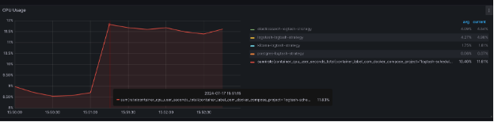
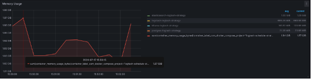
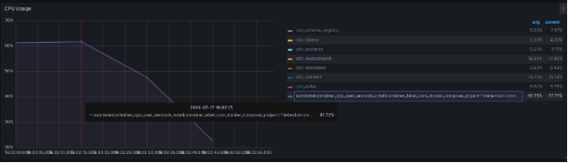
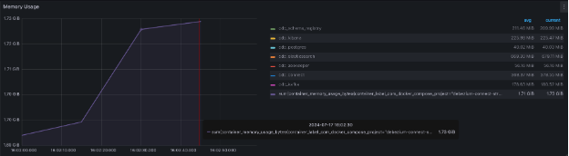
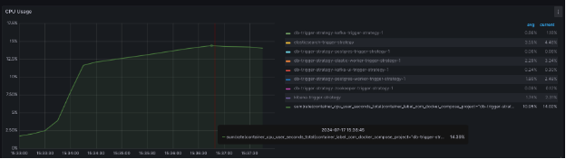
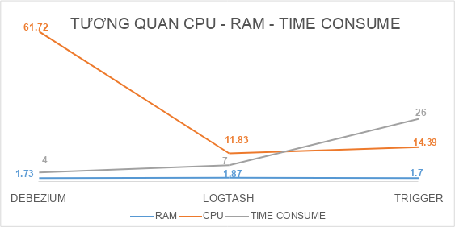
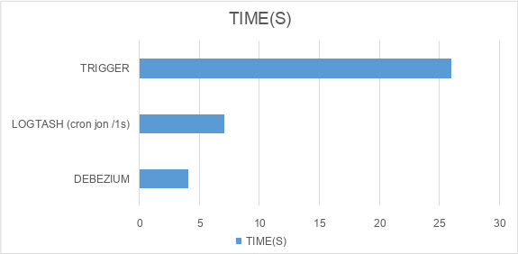

# Elastichsearch-database-sync-strategies

3 strategies for syncing data between Postgresql and Elasticsearch

**<span class="mark">SO SÁNH CÁC CHIẾN LƯỢC ĐỒNG BỘ DỮ LIỆU GIỮA
ELASTICSEARCH & POSTGRESQL</span>**

<span class="mark"></span>

**<span class="mark">1. Ý TƯỞNG</span>**

**<span class="mark">1.1 Sử dụng Debezium Data Capture</span>**


**<span class="mark">Ý tưởng chính như sau</span>**

1.  <span class="mark">Ta sẽ sử dụng Debezium Kafka Connect để bắt các
    event Insert/Update/Delete trong bảng sample_data của
    Postgres</span>

2.  <span class="mark">Debezium Kafka Connect sau khi bắt các event
    Insert/Update/Delete sẽ gửi các topic message vào Kafka queue</span>

3.  <span class="mark">Elastic Sink Connector có nhiệm vụ lắng nghe các
    topic từ Kafka queue để đánh index mới vào Elasticsearch</span>

**<span class="mark">Ta sẽ thực hiện hóa ý tưởng với Docker-compose gồm
các thành phần sau đây:</span>**

- <span class="mark"></span>Zookeeper: quản lý cấu hình và đồng bộ hóa
  cho Kafka và các thành phần liên quan.<span class="mark"></span>

- <span class="mark">Kafka: Message queue cho các topic event</span>

- <span class="mark">Postgres: cơ sở dữ liệu chính</span>

- <span class="mark">Elasticsearch + Kibana</span>

- <span class="mark">Schema_registry: dùng để định nghĩa một schema cho
  các dữ liệu truyền qua lại message queue, nhờ đó cả phía gửi và phía
  nhận message có thể thống nhất chung một schema dữ liệu. Vì
  vậy,</span> tất cả các thành phần dùng Kafka đều sử dụng cùng một
  schema từ Schema Registry, đảm bảo dữ liệu được xử lý đúng cấu
  trúc.<span class="mark"></span>

- <span class="mark">Debezium connect: gồm có 2 loại:</span>

> <span class="mark">+ postgres-source: có nhiệm vụ capture các thay đổi
> theo từng rows trong Postgresql, từ đó bắn message vào Kafka bằng cách
> sử dụng kafka-connect-jdbc</span>
>
> <span class="mark">+ ElasticsearchSinkConnector: subcribe các topic
> event change trong Kafka, nhận các dữ liệu mới và cập nhật index lại
> vào Elasticsearch bằng cách sử dụng kafka-connect-elasticsearch</span>

<span class="mark"></span>

**<span class="mark">1.2 Sử dụng Database Trigger</span>**


**<span class="mark">Ý tưởng chính như sau</span>**

1.  <span class="mark">Ta sẽ cài đặt các trigger trong database, có
    nhiệm vụ sẽ bắn pg_notify với payload là data tương ứng khi một row
    nào đó trong Postgresql có thay đổi (INSERT/UDATE/DELETE)</span>

2.  <span class="mark">Ta sẽ viết các Worker Service có nhiệm vụ lắng
    nghe các pg_notify này, sau đó truyền message vào Kafka</span>

3.  <span class="mark">Phía đầu bên kia, cũng sẽ có Worker Service khác
    consume message vừa bắn, và thực hiện đánh index vào
    Elasticsearch</span>

<span class="mark">Để thực hiện hóa ý tưởng sau, ta sẽ sử dụng
Docker-compose với các thành phần chính:</span>

- <span class="mark"></span>Zookeeper: quản lý cấu hình và đồng bộ hóa
  cho Kafka và các thành phần liên quan.<span class="mark"></span>

- <span class="mark">Kafka: Message queue cho các topic event</span>

- <span class="mark">Postgres: cơ sở dữ liệu chính</span>

<!-- -->

- <span class="mark">Elasticsearch + Kibana</span>

- <span class="mark">Postgres-worker: có nhiệm vụ lắng nghe các
  pg_notify từ Postgres, sau đó produce các message topic tương ứng vào
  Kafka</span>

- <span class="mark">Elastic-worker: có nhiệm vụ subcribe các topic
  tương ứng, và thực hiện đánh index cho Elasticsearch</span>

**<span class="mark">Lưu ý:</span>**

<span class="mark">Postgres-worker và Elastic-worker là hai thành phần
sẽ tự code, trong repo này ta sẽ sử dụng NodeJS để viết các
worker.</span>

**<span class="mark">1.3. Sử dụng Logtash</span>**


**<span class="mark">Ý tưởng chính như sau</span>**

> <span class="mark">Sẽ chạy cron job Logtash mỗi x time, Logtash sẽ
> chạy theo pipeline mà thu thập dữ liệu mới từ Postgres và đánh index
> vào Elasticsearch theo cơ chế như sau:</span>
>
> **<span class="mark">+ Các bảng cần sync thì phải có trường
> last_update: mang ý nghĩa timestamp của lần cuối update</span>**
>
> **<span class="mark">+ Mỗi lần chạy pipeline, Logtash sẽ lấy ra các
> rows có last_update \> sql_last_update, với sql_last_update là một
> biến có sẵn được Logtash tạo và lưu vào file riêng, giá trị của biến
> này sẽ là timestamp mà Logtash chạy pipeline lần cuối cùng.</span>**
>
> **<span class="mark">Ví dụ, trong repo này sử dụng bảng Employee làm
> bảng test cho cả 3 chiến lược, ta sẽ có lệnh SQL và Logtash sẽ chạy
> mỗi x time như sau:</span>**
>
> SELECT \* FROM public.employee WHERE last_update \> :sql_last_value
> AND last_update \< CURRENT_TIMESTAMP ORDER BY last_update ASC

**<span class="mark">Để thực hiện hóa ý tưởng trên, ta sẽ dùng
Docker-compose để gom lại các thành phần chính sau:</span>**

- <span class="mark">Postgres: cơ sở dữ liệu chính</span>

<!-- -->

- <span class="mark">Elasticsearch + Kibana</span>

- <span class="mark">Logtash: để chạy cron job gom các thay đổi dữ liệu
  mới và cập nhật vào Elasticsearch</span>

<span class="mark"></span>

**<span class="mark">2. Phân tích tiêu thụ tài nguyên hệ thống</span>**

<span class="mark">Resources setting cho docker container:</span>

<table>
<colgroup>
<col style="width: 50%" />
<col style="width: 50%" />
</colgroup>
<thead>
<tr class="header">
<th><mark>CPU LIMIT</mark></th>
<th><mark>RAM LIMIT</mark></th>
</tr>
</thead>
<tbody>
<tr class="odd">
<td><mark>12 (CPUS)</mark></td>
<td><mark>2.53GB</mark></td>
</tr>
</tbody>
</table>

<span class="mark"></span>

**<span class="mark">2.1. Ram + CPU khi thực hiện INSERT 10K
records</span>**

Tôi sẽ thử insert random 10K Record:

```
INSERT INTO employee (name, email, salary, city, last_update)
SELECT
    LEFT(MD5(RANDOM()::TEXT), 120) AS name,
    LEFT(MD5(RANDOM()::TEXT), 45) || '@example.com' AS email,
    (RANDOM() * 100000 + 30000)::BIGINT AS salary,
    LEFT(MD5(RANDOM()::TEXT), 10) AS city,
    CURRENT_TIMESTAMP
FROM generate_series(1, 10000);
```

<span class="mark">Dưới đây là bài benchmark insert 10k records để xem
mức tiêu thụ CPU, Ram và thời gian tiêu hao để sync toàn bộ dữ liệu vào
Elasticsearch của mỗi chiến lược.</span>

<span class="mark">Tôi sẽ sử dụng Grafana để mornitoring.</span>

<span class="mark">**2.1.1. Sử dụng Logtash**</span>

- <span class="mark">CPU USAGE:</span>

> <span class="mark">+ Max: 11.83%</span>
>
> <span class="mark">+ AVG: 10.40%</span>



<span class="mark"></span>

- <span class="mark">MEMORY USAGE:</span>



<span class="mark">+ Max: 1.87GB</span>

<span class="mark">+ AVG 1.84GB</span>

<span class="mark"></span>

<span class="mark">CONCLUSION:</span>

<table>
<colgroup>
<col style="width: 19%" />
<col style="width: 19%" />
<col style="width: 19%" />
<col style="width: 19%" />
<col style="width: 20%" />
</colgroup>
<thead>
<tr class="header">
<th><mark>CPU (max)</mark></th>
<th><mark>CPU (avg)</mark></th>
<th><mark>RAM (max)</mark></th>
<th><mark>RAM (avg)</mark></th>
<th><mark>TIME CONSUME (*)</mark></th>
</tr>
</thead>
<tbody>
<tr class="odd">
<td><mark>11.83%</mark></td>
<td><mark>10.4%</mark></td>
<td><mark>1.87GB</mark></td>
<td><mark>1.84GB</mark></td>
<td><mark></mark>7s45ms<mark></mark></td>
</tr>
</tbody>
</table>

<span class="mark"></span>

<span class="mark">**(\*) Time consume:** Thời gian tiêu tốn để 10k
records được sync hoàn toàn từ database vào elasticsearch.</span>

**<span class="mark">2.1.2. Sử dụng Debezium</span>**

- <span class="mark">CPU USAGE:</span>

> <span class="mark">+ Max: 61.72%</span>
>
> <span class="mark">+ AVG: 48.35%</span>



<span class="mark"></span>

<span class="mark"></span>

<span class="mark"></span>

<span class="mark"></span>

<span class="mark"></span>

- <span class="mark">MEMORY USAGE:</span>



<span class="mark">+ Max: 1.73GB</span>

<span class="mark">+ AVG: 1.71GB</span>

<span class="mark"></span>

<span class="mark">CONCLUSION:</span>

<table>
<colgroup>
<col style="width: 19%" />
<col style="width: 19%" />
<col style="width: 19%" />
<col style="width: 19%" />
<col style="width: 20%" />
</colgroup>
<thead>
<tr class="header">
<th><mark>CPU (max)</mark></th>
<th><mark>CPU (avg)</mark></th>
<th><mark>RAM (max)</mark></th>
<th><mark>RAM (avg)</mark></th>
<th><mark>TIME CONSUME (*)</mark></th>
</tr>
</thead>
<tbody>
<tr class="odd">
<td><mark>61.72%</mark></td>
<td><mark>48.35%</mark></td>
<td><mark>1.73GB</mark></td>
<td><mark>1.71GB</mark></td>
<td><mark>4s06ms</mark></td>
</tr>
</tbody>
</table>

<span class="mark"></span>

<span class="mark">**(\*) Time consume:** Thời gian tiêu tốn để 10k
records được sync hoàn toàn từ database vào elasticsearch.</span>

<span class="mark"></span>

**<span class="mark">2.1.3. Sử dụng Trigger</span>**

- <span class="mark">CPU USAGE:</span>

> <span class="mark">+ Max: 14.39%</span>
>
> <span class="mark">+ AVG: 10.95%</span>



<span class="mark"></span>

<span class="mark"></span>

<span class="mark"></span>

<span class="mark"></span>

<span class="mark"></span>

- <span class="mark">MEMORY USAGE:</span>


<span class="mark">+ Max: 1.7GB</span>

<span class="mark">+ AVG: 1.48GB</span>

<span class="mark"></span>

<span class="mark">CONCLUSION:</span>

<table>
<colgroup>
<col style="width: 19%" />
<col style="width: 19%" />
<col style="width: 19%" />
<col style="width: 19%" />
<col style="width: 20%" />
</colgroup>
<thead>
<tr class="header">
<th><mark>CPU (max)</mark></th>
<th><mark>CPU (avg)</mark></th>
<th><mark>RAM (max)</mark></th>
<th><mark>RAM (avg)</mark></th>
<th><mark>TIME CONSUME (*)</mark></th>
</tr>
</thead>
<tbody>
<tr class="odd">
<td><mark>14.39%</mark></td>
<td><mark>10.95%</mark></td>
<td><mark>1.7GB</mark></td>
<td><mark>1.48GB</mark></td>
<td><mark>26s88ms</mark></td>
</tr>
</tbody>
</table>

<span class="mark"></span>

<span class="mark">**(\*) Time consume:** Thời gian tiêu tốn để 10k
records được sync hoàn toàn từ database vào elasticsearch.</span>

<span class="mark"></span>

**<span class="mark">2.2. TỔNG KẾT</span>**

<span class="mark"></span>

<span class="mark"></span>



<span class="mark"></span>

<span class="mark"></span>

<span class="mark"></span>

<span class="mark"></span>

<span class="mark"></span>

**<span class="mark">2.3. Độ trễ từ lúc chạy SQL INSERT 10K RECORDS cho
đến khi có đủ data trong Elasticsearch</span>**

<span class="mark"></span>



<span class="mark"></span>

<span class="mark"></span>

**<span class="mark">3. ƯU NHƯỢC ĐIỂM TỪNG CHIẾN LƯỢC</span>**

<table>
<colgroup>
<col style="width: 25%" />
<col style="width: 25%" />
<col style="width: 25%" />
<col style="width: 25%" />
</colgroup>
<thead>
<tr class="header">
<th><mark></mark></th>
<th><mark>DEBEZIUM</mark></th>
<th><mark>LOGTASH</mark></th>
<th><mark>TRIGGER</mark></th>
</tr>
</thead>
<tbody>
<tr class="odd">
<td><mark>Độ khó setup</mark></td>
<td><mark>Trung bình: cần config 6 thành phần trong
docker-compose</mark></td>
<td><mark>Đơn giản hơn: chỉ cần config 3 thành phần trong
docker-compose</mark></td>
<td><mark>Phức tạp: ngoài config 6 thành phần trong docker-compose, còn
phải setup trigger, function cho Postgres, ngoài ra còn phải viết 2
worker chịu trách nhiệm produce và consume message</mark></td>
</tr>
<tr class="even">
<td><mark>Hỗ trợ bắt event INSERT</mark></td>
<td><mark>Có</mark></td>
<td><mark>Có</mark></td>
<td><mark>Có</mark></td>
</tr>
<tr class="odd">
<td><mark>Hỗ trợ bắt event UPDATE</mark></td>
<td><mark>Có</mark></td>
<td><mark>Có</mark></td>
<td><mark>Có</mark></td>
</tr>
<tr class="even">
<td><mark>Hỗ trợ bắt event DELETE</mark></td>
<td><mark>Có</mark></td>
<td><mark><strong>KHÔNG</strong> (Bởi vì hoạt động theo cơ chế theo dõi
column last_update =&gt; record bị delete thì sẽ không được track =&gt;
giải pháp: sử dụng soft delete)</mark></td>
<td><mark>Có</mark></td>
</tr>
<tr class="odd">
<td><mark>Nhược điểm chính</mark></td>
<td><mark>Khó setup hơn so với dùng Logtash, sử dụng khá nhiều thành
phần</mark></td>
<td><mark>Bắt buộc phải dùng soft_delete, và bắt buộc phải có trường
last_update</mark></td>
<td><mark>Khó setup nhất</mark></td>
</tr>
</tbody>
</table>

<span class="mark"></span>
