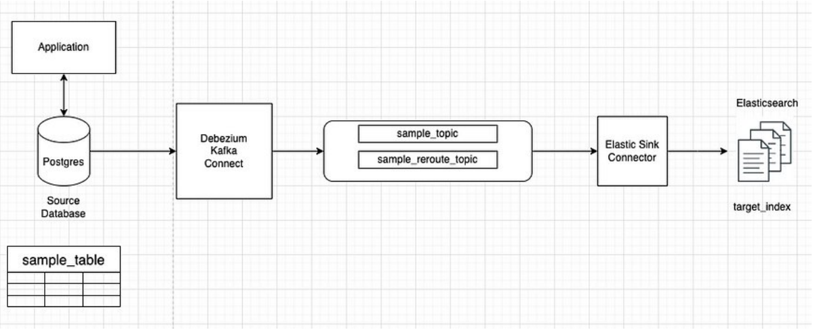
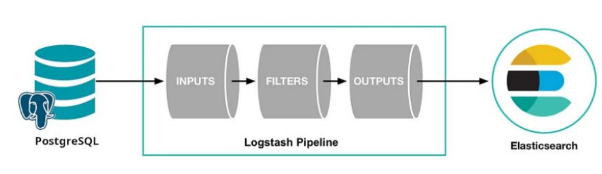

# Elastichsearch-database-sync-strategies
3 strategies for syncing data between Postgresql and Elasticsearch

Auto insert ramdom 10k record:
```
INSERT INTO employee (name, email, salary, city, last_update)
SELECT
    LEFT(MD5(RANDOM()::TEXT), 120) AS name,
    LEFT(MD5(RANDOM()::TEXT), 45) || '@example.com' AS email,
    (RANDOM() * 100000 + 30000)::BIGINT AS salary,
    LEFT(MD5(RANDOM()::TEXT), 10) AS city,
    CURRENT_TIMESTAMP
FROM generate_series(1, 10000);
```

**SO SÁNH CÁC CHIẾN LƯỢC ĐỒNG BỘ DỮ LIỆU GIỮA ELASTICSEARCH & POSTGRESQL**

**1\. Ý TƯỞNG**

**1.1 Sử dụng Debezium Data Capture**




**Ý tưởng chính như sau**

1. Ta sẽ sử dụng Debezium Kafka Connect để bắt các event Insert/Update/Delete trong bảng sample_data của Postgres
2. Debezium Kafka Connect sau khi bắt các event Insert/Update/Delete sẽ gửi các topic message vào Kafka queue
3. Elastic Sink Connector có nhiệm vụ lắng nghe các topic từ Kafka queue để đánh index mới vào Elasticsearch

**Ta sẽ thực hiện hóa ý tưởng với Docker-compose gồm các thành phần sau đây:**

- Zookeeper: quản lý cấu hình và đồng bộ hóa cho Kafka và các thành phần liên quan.
- Kafka: Message queue cho các topic event
- Postgres: cơ sở dữ liệu chính
- Elasticsearch + Kibana
- Schema_registry: dùng để định nghĩa một schema cho các dữ liệu truyền qua lại message queue, nhờ đó cả phía gửi và phía nhận message có thể thống nhất chung một schema dữ liệu. Vì vậy, tất cả các thành phần dùng Kafka đều sử dụng cùng một schema từ Schema Registry, đảm bảo dữ liệu được xử lý đúng cấu trúc.
- Debezium connect: gồm có 2 loại:

\+ postgres-source: có nhiệm vụ capture các thay đổi theo từng rows trong Postgresql, từ đó bắn message vào Kafka bằng cách sử dụng kafka-connect-jdbc

\+ ElasticsearchSinkConnector: subcribe các topic event change trong Kafka, nhận các dữ liệu mới và cập nhật index lại vào Elasticsearch bằng cách sử dụng kafka-connect-elasticsearch

**1.2 Sử dụng Database Trigger**


**Ý tưởng chính như sau**

1. Ta sẽ cài đặt các trigger trong database, có nhiệm vụ sẽ bắn pg_notify với payload là data tương ứng khi một row nào đó trong Postgresql có thay đổi (INSERT/UDATE/DELETE)
2. Ta sẽ viết các Worker Service có nhiệm vụ lắng nghe các pg_notify này, sau đó truyền message vào Kafka
3. Phía đầu bên kia, cũng sẽ có Worker Service khác consume message vừa bắn, và thực hiện đánh index vào Elasticsearch

Để thực hiện hóa ý tưởng sau, ta sẽ sử dụng Docker-compose với các thành phần chính:

- Zookeeper: quản lý cấu hình và đồng bộ hóa cho Kafka và các thành phần liên quan.
- Kafka: Message queue cho các topic event
- Postgres: cơ sở dữ liệu chính
- Elasticsearch + Kibana
- Postgres-worker: có nhiệm vụ lắng nghe các pg_notify từ Postgres, sau đó produce các message topic tương ứng vào Kafka
- Elastic-worker: có nhiệm vụ subcribe các topic tương ứng, và thực hiện đánh index cho Elasticsearch

**Lưu ý:**

Postgres-worker và Elastic-worker là hai thành phần sẽ tự code, trong repo này ta sẽ sử dụng NodeJS để viết các worker.

**1.3. Sử dụng Logtash**



**Ý tưởng chính như sau**

Sẽ chạy cron job Logtash mỗi x time, Logtash sẽ chạy theo pipeline mà thu thập dữ liệu mới từ Postgres và đánh index vào Elasticsearch theo cơ chế như sau:

**\+ Các bảng cần sync thì phải có trường last_update: mang ý nghĩa timestamp của lần cuối update**

**\+ Mỗi lần chạy pipeline, Logtash sẽ lấy ra các rows có last_update > sql_last_update, với sql_last_update là một biến có sẵn được Logtash tạo và lưu vào file riêng, giá trị của biến này sẽ là timestamp mà Logtash chạy pipeline lần cuối cùng.**

**Ví dụ, trong repo này sử dụng bảng Employee làm bảng test cho cả 3 chiến lược, ta sẽ có lệnh SQL và Logtash sẽ chạy mỗi x time như sau:**

SELECT \* FROM public.employee WHERE last_update > :sql_last_value AND last_update < CURRENT_TIMESTAMP ORDER BY last_update ASC

**Để thực hiện hóa ý tưởng trên, ta sẽ dùng Docker-compose để gom lại các thành phần chính sau:**

- Postgres: cơ sở dữ liệu chính
- Elasticsearch + Kibana
- Logtash: để chạy cron job gom các thay đổi dữ liệu mới và cập nhật vào Elasticsearch

**2\. Phân tích tiêu thụ tài nguyên hệ thống**

Resources setting cho docker container:

| CPU | RAM |
| --- | --- |
| 12  | 2.53GB |

**2.1. Ram + CPU khi thực hiện INSERT 10K records**

**2.1.1. Sử dụng Logtash**


| CPU | RAM |
| --- | --- |
| 5/12 CPU | 1.91/2.53 GB |

**2.1.2. Sử dụng Debezium**


| CPU | RAM |
| --- | --- |
| 1.4/12 CPU | 2.08/2.53 GB |

2.1.3. Sử dụng Trigger


| CPU | RAM |
| --- | --- |
| 6.89/12 CPU | 1.9/2.53 GB |

**2.2. TỔNG KẾT**


**2.3. Độ trễ từ lúc chạy SQL INSERT 10K RECORDS cho đến khi có đủ data trong Elasticsearch**


**3\. ƯU NHƯỢC ĐIỂM TỪNG CHIẾN LƯỢC**

|     | DEBEZIUM | LOGTASH | TRIGGER |
| --- | --- | --- | --- |
| Độ khó setup | Trung bình: cần config 6 thành phần trong docker-compose | Đơn giản hơn: chỉ cần config 3 thành phần trong docker-compose | Phức tạp: ngoài config 6 thành phần trong docker-compose, còn phải setup trigger, function cho Postgres, ngoài ra còn phải viết 2 worker chịu trách nhiệm produce và consume message |
| Hỗ trợ bắt event INSERT | Có  | Có  | Có  |
| Hỗ trợ bắt event UPDATE | Có  | Có  | Có  |
| Hỗ trợ bắt event DELETE | Có  | **KHÔNG** (Bởi vì hoạt động theo cơ chế theo dõi column last_update => record bị delete thì sẽ không được track => giải pháp: sử dụng soft delete) | Có  |
| Nhược điểm chính | Khó setup hơn so với dùng Logtash, sử dụng khá nhiều thành phần | Bắt buộc phải dùng soft_delete, và bắt buộc phải có trường last_update | Khó setup nhất |